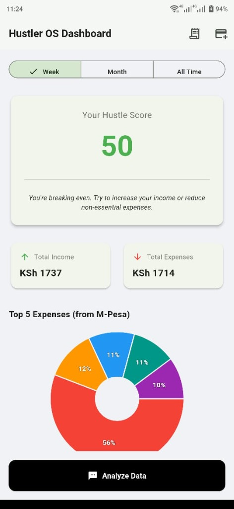

# Hustler OS - Official Website 🚀



> **The Zero-Effort Financial Agent for Africa's Informal Economy.**

This repository hosts the official landing page for **Hustler OS**, a fintech mobile application that automates M-Pesa tracking, receipt scanning, and smart invoicing for Kenyan entrepreneurs.

🔗 **Live Site:** [https://hustler-os.vercel.app](https://hustler-os.vercel.app)  
📱 **Mobile App Repo:** [github.com/YourUsername/hustler-os](https://github.com/YourUsername/hustler-os)

---

## 🛠 Tech Stack

This website was built with a **"Zero-Build"** philosophy for maximum performance and ease of deployment.

* **Core:** Semantic HTML5
* **Styling:** Tailwind CSS (via CDN)
* **Icons:** FontAwesome
* **Typography:** Google Fonts (Roboto & Montserrat)
* **Hosting:** Vercel (Auto-deployed from GitHub)

---

## 📂 Project Structure

```bash
hustler-os-web/
├── assets/
│   ├── dashboard.jpg    # Hero screenshot (App Dashboard)
│   └── favicon.png      # Browser tab icon
├── index.html           # The single-page application
└── README.md            # You are here
```

---

## 🚀 How to Run Locally

Because this project uses the Tailwind CDN, you don't need `npm` or `node_modules`.

1.  **Clone the repository:**
    ```bash
    git clone https://github.com/YOUR_USERNAME/hustler-os-web.git
    ```
2.  **Open `index.html`** in any browser.
      * *Tip:* For the best experience, use the "Live Server" extension in VS Code.

---

## 📲 App Download Flow

The primary goal of this landing page is to distribute the Android APK.

1.  The **"Download Beta"** button in `index.html` is linked directly to our **GitHub Releases**.
2.  This allows for "Guerrilla Distribution" without needing the Google Play Store immediately.
3.  The site includes instructions for users to bypass Google Play Protect ("Install Anyway") during the beta phase.

---

## 🎨 Design System

  * **Theme:** Dark Mode / Fintech Professional
  * **Background:** Charcoal (`#121212`)
  * **Primary Accent:** Money Green (`#22c55e`)
  * **Text:** White & Light Gray (`#cbd5e1`)

---

## 🤝 Contributing

This is a static site. If you notice a typo or a broken link:

1.  Fork the repo.
2.  Make your change in `index.html`.
3.  Submit a Pull Request.

---

<p align="center">
Built with ❤️ in Nairobi by <strong>John Apollos</strong>.
<br>
© 2025 Hustler OS
</p>
